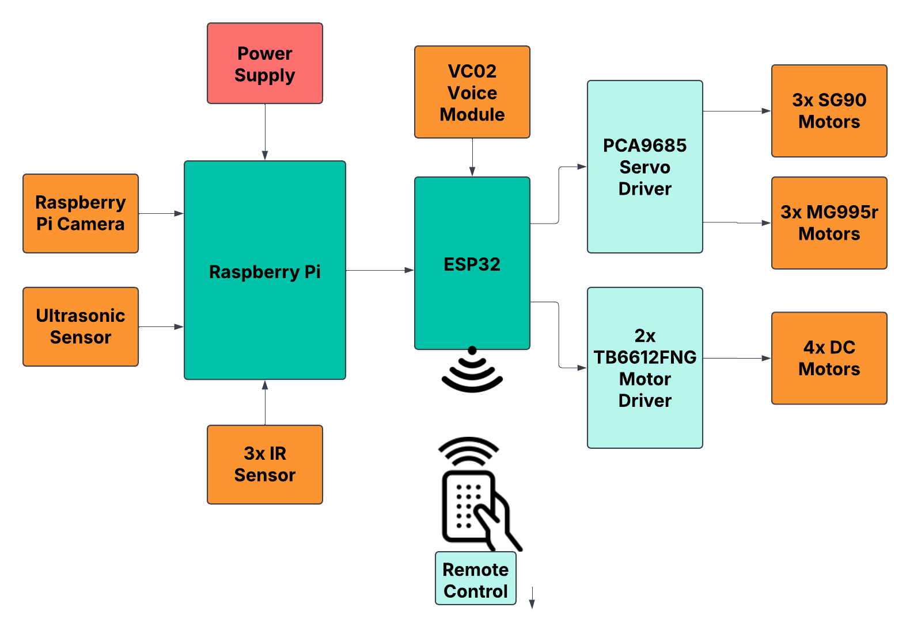

# Hardware Components

The JARVIS robot consists of the following hardware components:

- Raspberry Pi 4   
- ESP32  
- Pi Camera 3 Module
- VC02 Voice Module  
- 3D Printed Robotic Arm
- Chassis
- Mecanum Wheels
- MG995 Servo Motors  
- SG90 Servo Motor  
- PCA9685 Servo Driver
- DC Motors
- TB6612FNG Motor Driver
- Ultrasonic Sensor 
- IR Sensor
- 12V 2200mAh 80C battery
- XL4015 Buck Converter
- LM2596 Buck Converter

 ## Description

- Raspberry Pi 4  
  Acts as the main processing unit running ROS2 and handling high-level control.

- ESP32  
  Controls all motors and manages communication with the Raspberry Pi.

- Pi Camera 3 Module  
  Captures visual data for human and object detection.

- VC02 Voice Module  
  Processes voice commands and sends data to the ESP32.

- 3D Printed Robotic Arm  
  Enables object grasping and pick-and-place operations.

- Chassis  
  Provides the base structure of the robot.

- Mecanum Wheels  
  Enable omnidirectional movement.

- MG995 Servo Motors  
  Used for high-torque movement in the lower part of the robotic arm.

- SG90 Servo Motor  
  Used for low-torque movement in the upper part of the robotic arm.

- PCA9685 Servo Driver  
  Controls multiple servo motors efficiently.

- DC Motors  
  Drive the robot’s movement.

- TB6612FNG Motor Driver  
  Controls DC motor speed and direction.

- Ultrasonic Sensor  
  Measures distance for obstacle avoidance.

- IR Sensor  
  Used for line following.

- 12V 2200mAh 80C Battery  
  Provides power to the robot.

- XL4015 Buck Converter  
  Steps down voltage for servo motors.

- LM2596 Buck Converter  
  Provides regulated voltage for low-power components like Raspberry Pi, ESP32, and sensors.

## Block Diagram

